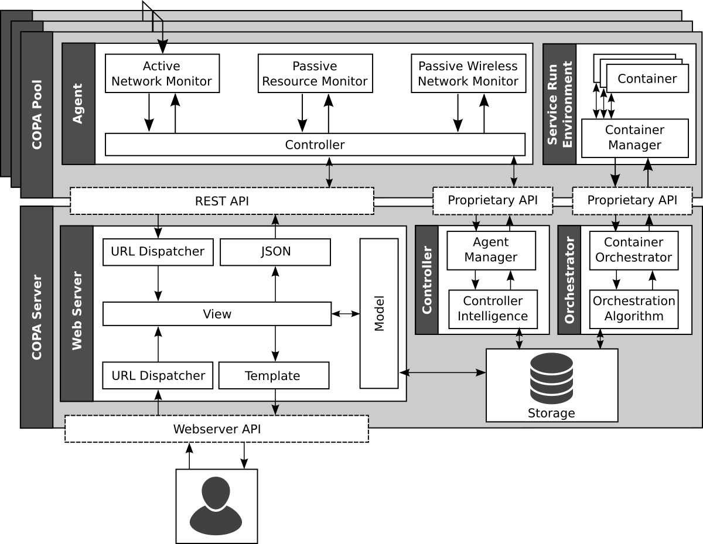

# COPA - Container Orchestration and Provisioning Architecture

COPA is a wireline/wireless convergent network monitoring and container manager architecture. This software architecture monitors resources and network quality of container-based virtualization hosts and enables the managements of containerized services through an API and an web interface. The objective of COPA is emulates a Cloud and Fog computing scenario that utilizes container-based virtualization in a converged network testbed infrastructure.


## 1. Installation instructions
*IMPORTANT: THIS TUTORIAL WAS TESTED WITH PYTHON3 ON UBUNTU 16.04 LTS, 17.04 and 17.10!*

First, you need to have at least two computers or virtual machines to play the roles of COPA Server and COPA Pool.

Then, you must clone this repository into `$COPA_HOME` into COPA Server and COPA Pools:
```bash
git clone https://gitlab.com/futebol/COPA.git $COPA_HOME
```
### 1.1. Software requirements
#### 1.1.1 COPA Server and COPA Pools
```bash
sudo apt-add-repository ppa:ubuntu-lxc/stable #This adds the latest stable version of LXD and its dependencies.
sudo apt update
sudo apt install -y python3-pip nodejs nodejs-legacy npm lxd criu
sudo pip3 install -r requirements.txt
cd  $COPA_HOME
sudo npm install express socket.io pty term.js
```
#### 1.1.2 COPA Pool ONLY
First, you need to install psutil and libi2util-dev

psutil serves to passive measure CPU, virtual memory and network throughput.
libi2util-dev gives support to Owamp actively measure network one-way latency and jitter
```bash
sudo pip3 install psutil
sudo apt-get install libi2util-dev
```

Now you need to install owamp, that is the tool to measure the network link

Go to a folder where your user can run executables and download the owamp files.
```bash
wget http://software.internet2.edu/sources/owamp/owamp-3.4-10.tar.gz
```

Then, extract, configure, make and install
```bash
tar xzf owamp-3.4-10.tar.gz
cd owamp-3.4
./configure
make
sudo make install
```

### 1.2 LXD initial configuration
*This must be done in all LXD Hosts (COPA Server and COPA Pools)!*

To setup the container pools, refer to the README.md file on the [live-migration](live-migration) folder.

Make your user part of the lxd group, so you dont need SUDO privileges to work with LXD:
```bash
sudo usermod -aG lxd $USER
```
Run the following command and follow its instructions. When it ask if you want to LXD to be available over the network, answer yes and setup the standard access IP, PORT and PASSWORD.
```bash
lxd init
```
After that, you must use the following commands so LXD :
```bash
lxc config set core.https_address [::]:8443
lxc config set core.https_allowed_origin [::]:8443
lxc config set core.https_allowed_methods "GET, POST, PUT, DELETE, OPTIONS"
lxc config set core.https_allowed_headers "Origin, X-Requested-With, Content-Type, Accept"
lxc config set core.https_allowed_credentials "true"
```
### 1.3 Ceritificates configuration
This part of the tutorial is necessary to COPA Web Server can remotely access COPA Pools through private/public certification.
#### 1.3.1 COPA Server certificates
First, enter in COPA Server certs folder in `copa_server/certs`.
*Change the IP located at the `openssl.cnf` file (`subjectAltName = IP:$COPA_SERVER_IP`), so it matches the COPA Server IP.*
 After that, run:
```bash
sudo sh makeCOPA-CA.sh
```

This wil create the appropriate Certificate Authority to be used with COPA.
After that, run:

```bash
sudo sh makeCOPAcerts.sh
```

Now, copy this folder to the COPA Pools.  You will need it.
```bash
scp -r $COPA_HOME/certs <SERVER>@<HOST>:~/
```
#### 1.3.2 COPA Pool certificates
First, enter in COPA Pool certs folder in `copa_pool/certs`.
*Change the IP located at the `openssl.cnf` file (`subjectAltName = IP:$COPA_POOL_IP`), so it matches the COPA Pool that you are setting up.*
After that, run:
```bash
sudo sh makeCert-pool.sh
```

Also, you need to add the COPA Server certificate (`lxd.crt`) to the LXD trusted hosts list on each LXD host, using:
```bash
lxc config trust add certs/lxd.crt
```
Now your COPA Server and COPA Pools are ready to use.
### 1.4 Configuring COPA Pools IP in COPA Server
In this section we need to add COPA Pools IP at `servers.txt` file, so COPA Web Server can be initiated and connect to COPA Pools.

Enter in `$COPA_HOME/servers.txt` and list COPA Pools as the example below.
`Pattern: $POOL_NAME;$POOL_IP;$LXD_PORT`
```
Pool1;192.168.1.50:8443
Pool2;192.168.1.50:8443
```
### 1.5 Build the COPA Web Server database
Execute the following commands:
```bash
cd $COPA_HOME/containers_site
python3 manage.py makemigrations
python3 manage.py migrate
```
## 2. Starting COPA
First you need to start the monitors in COPA Pools. *The order is important*
### 2.1 At COPA Pool
#### 2.1.1 Start Owamp server

The owamp server needs to be started so the other pools can connect and measure the network link
```bash
sudo owampd -c $OWAMP_HOME/conf -v -U $USER -G $USER_GROUP
```

#### 2.1.2 Owamp server at startup

The owamp server can be set up to start at computer startup

This can be made by adding the command at "/etc/rc.local"

#### 2.1.3 Running copa monitor

You need to execute at the COPA Pools the monitor.py
```bash
cd  $COPA_HOME/copa_monitor
python3 monitor.py
```

### 2.2 At COPA Server
Modify the following files:
*  `$COPA_HOME/container_site/core/COPA_general.py`:
```bash
COPA_HOME = "" # Location of the COPA home.
COPA_HOST = '192.168.200.223' # COPA's host IP address.
```
*  `server_socket.js`:
```bash
var COPA_HOME = "" //Location of the COPA home.
```

To start COPA execute:
```bash
cd $COPA_HOME/containers_site/
python3 manage.py runserver 0.0.0.0:8000
python3 manage.py shell < core/refresh_service.py
```

Then, start nodejs to enable the web browser container terminal feature.
```bash
cd $COPA_HOME/containers_site/core/static/core/xterm/dist/
node server_socket.js
```

Access via web browser `HOST_IP:8000` or `HOSTNAME:8000`